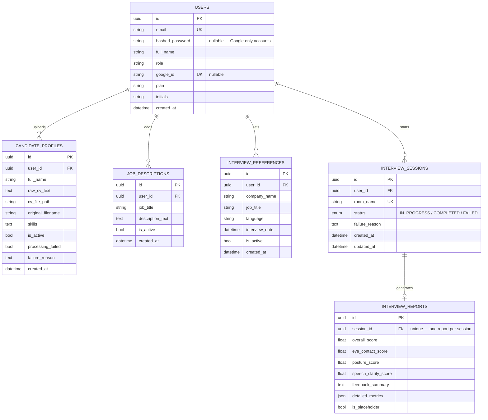
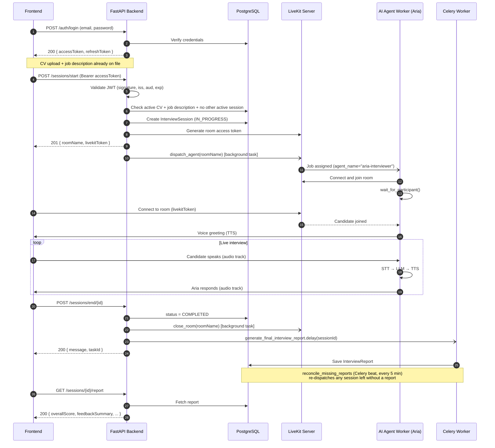

# IntervYou — AI Interviewer Backend

## 1. Project Overview

IntervYou is the backend for an AI-powered mock-interview platform. A
candidate registers, uploads a CV, and adds a target job description; the
backend then starts a **live voice interview** in a LiveKit room, where an
AI agent ("Aria") listens via speech-to-text, reasons with an LLM, and
replies with synthesized speech in real time — the same round trip as a
real interviewer, end to end. When the interview ends, a report is
generated and stored against the session.

**Core stack**

| Layer | Technology |
|---|---|
| API framework | FastAPI (async) |
| Database | PostgreSQL via SQLAlchemy 2.0 (async) + Alembic migrations |
| Cache / queues | Redis (rate limiting, token revocation, agent health) |
| Background jobs | Celery (report generation, CV parsing, scheduled reconciliation) |
| Real-time voice | LiveKit (WebRTC) + `livekit-agents` (STT → LLM → TTS pipeline) |
| Auth | JWT (access/refresh/reset) + Google Sign-In (`id_token` or `access_token`) |

**What the backend owns:**
- Account creation and authentication (email/password and Google).
- CV upload, parsing, and storage.
- Job description and interview-preference management.
- Interview session lifecycle: start → live voice interview → end → report.
- Dispatching and supervising the AI interviewer agent for each session.

---

## 2. Prerequisites & Installation

### Prerequisites

- Python 3.10+
- PostgreSQL 15+ and Redis 7+ (or Docker, see below)
- A LiveKit server (self-hosted via Docker, or a [LiveKit Cloud](https://cloud.livekit.io) project)
- Git

The fastest way to get PostgreSQL, Redis, and a local LiveKit server running is:

```bash
docker-compose up -d
```

### Clone the repository

```bash
git clone <repository-url>
cd "Ai_interviewer backend"
```

### Create and activate a virtual environment

Pick the block that matches your shell.

<details open>
<summary><strong>CMD (Windows)</strong></summary>

```bat
python -m venv venv
venv\Scripts\activate.bat
```

</details>

<details>
<summary><strong>PowerShell (Windows)</strong></summary>

```powershell
python -m venv venv
venv\Scripts\Activate.ps1
```

> If script execution is blocked, run once per session:
> `Set-ExecutionPolicy -Scope Process -ExecutionPolicy Bypass`

</details>

<details>
<summary><strong>Git Bash (Windows)</strong></summary>

```bash
python -m venv venv
source venv/Scripts/activate
```

</details>

<details>
<summary><strong>macOS / Linux</strong></summary>

```bash
python3 -m venv venv
source venv/bin/activate
```

</details>

Your prompt should now be prefixed with `(venv)` in every case above.

### Install dependencies

```bash
pip install -r requirements.txt
```

### Configure environment variables

```bash
cp .env.example .env      # macOS/Linux/Git Bash
copy .env.example .env    # Windows CMD/PowerShell
```

Then fill in `.env`. At minimum for local development:

| Variable | Required | Notes |
|---|---|---|
| `SECRET_KEY` | **Yes** | No default on purpose — the app refuses to start without it. Generate with `python -c "import secrets; print(secrets.token_hex(48))"` |
| `POSTGRES_URL` | Yes | Defaults to a local Postgres instance |
| `REDIS_URL` | Yes | Defaults to a local Redis instance |
| `LIVEKIT_URL` / `LIVEKIT_API_KEY` / `LIVEKIT_API_SECRET` | Yes | From your LiveKit server or Cloud project |
| `DEEPGRAM_API_KEY` / `OPENAI_API_KEY` / `ELEVEN_API_KEY` | Only for the AI agent | STT / LLM / TTS providers — the API server runs fine without them, but the agent worker refuses to start until all three are set |
| `GOOGLE_CLIENT_ID` | Optional | Enables `POST /api/v1/auth/google` |
| `SMTP_*` | Optional | Enables real password-reset emails; unset falls back to printing the link to the console |

See `.env.example` for the full list with descriptions.

### Apply database migrations

```bash
alembic upgrade head
```

---

## 3. Running the Application

Three independent processes make up a full local environment. Run each in
its own terminal (with the virtual environment activated).

**1 — Infrastructure** (PostgreSQL, Redis, local LiveKit server):

```bash
docker-compose up -d
```

**2 — API server:**

```bash
python -m app.main
```

This binds to `0.0.0.0:8000`, so it's reachable from a phone, an emulator,
or through a tunnel like ngrok — not just from this machine. (Running
`uvicorn app.main:app --reload` directly binds to `127.0.0.1` only; add
`--host 0.0.0.0` explicitly if you use that form instead.)

- Interactive API docs: `http://localhost:8000/docs`

**3 — Background workers** (report generation, CV parsing — required for
those features, independent of the voice agent below):

```bash
celery -A app.workers.celery_app worker --loglevel=info
celery -A app.workers.celery_app beat --loglevel=info
```

**4 — AI interviewer agent** (required for the live voice interview itself
— without this running, a candidate joins an empty room):

```bash
python -m app.interviews.workers.livekit_agent start   # production
python -m app.interviews.workers.livekit_agent dev     # local dev, verbose logs
```

This process reads `DEEPGRAM_API_KEY`, `OPENAI_API_KEY`, and
`ELEVEN_API_KEY` directly from `.env` and refuses to start if any is
missing.

---

## 4. Database ERD Diagram



**Notes:**
- `CANDIDATE_PROFILES`, `JOB_DESCRIPTIONS`, and `INTERVIEW_PREFERENCES` each
  use an `is_active` flag rather than deleting old rows — a new upload
  deactivates the previous one, keeping full history.
- A partial unique index on `INTERVIEW_SESSIONS(user_id)` (where
  `status = 'IN_PROGRESS'`) enforces **at most one active session per
  user** at the database level, not just in application code.
- All foreign keys cascade on delete.

---

## 5. Backend Workflow Cycle Diagram

End-to-end flow for one interview, from login through the live voice
session to the final report.



---

## 6. Git & PR Workflow

1. **Pull latest `main`:**
   ```bash
   git checkout main && git pull origin main
   ```
2. **Branch per task:** `git checkout -b feat/task-name` or `fix/issue-name`
3. **Commit and push:**
   ```bash
   git add .
   git commit -m "feat: description of the change"
   git push origin feat/task-name
   ```
4. **Open a Pull Request** into `main`.

> ⚠️ Direct pushes to `main` are not allowed. Every change goes through a
> reviewed and approved Pull Request.
